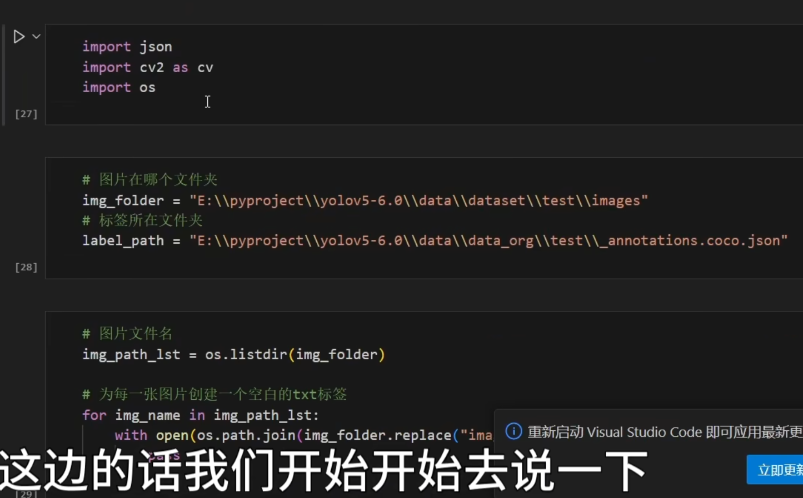
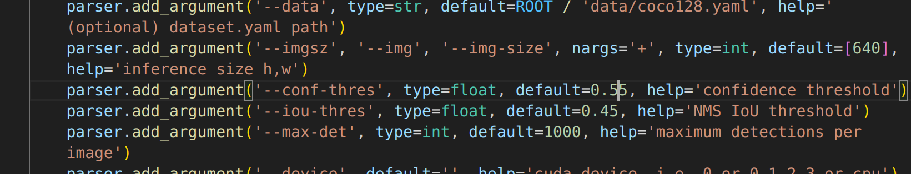
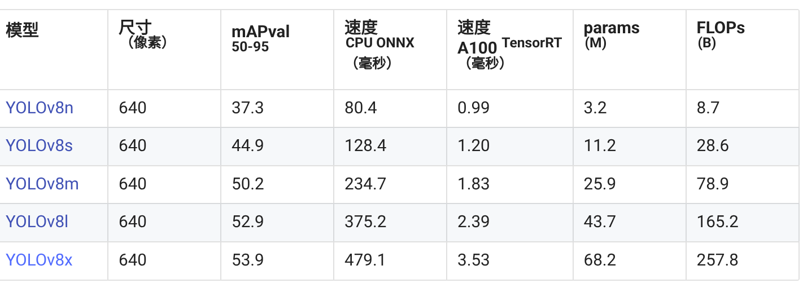
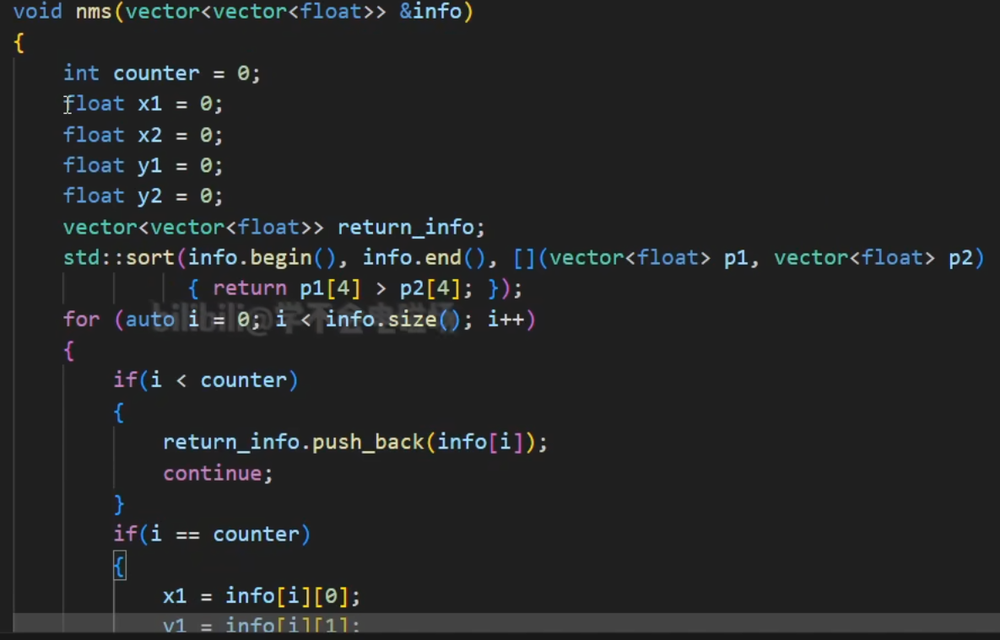
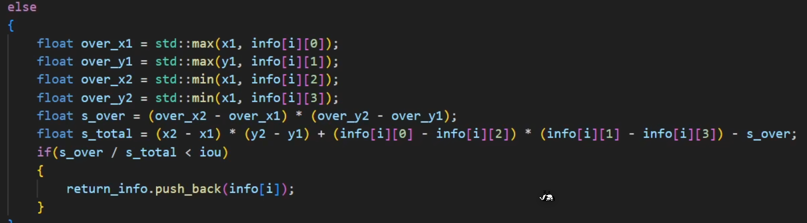
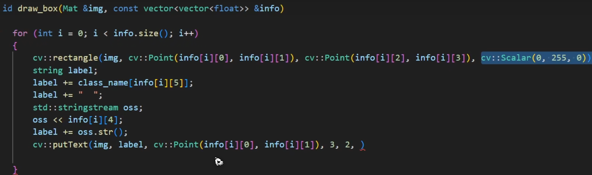
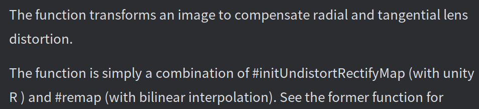
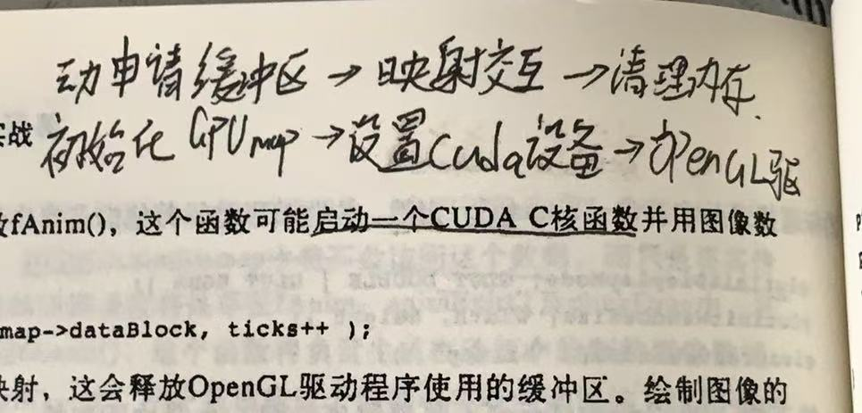

#### 重新构建cmake

```
cd ~/vision/yolo_tensorrt
rm -f CMakeCache.txt
rm -rf CMakeFiles
cmake .
```

```
cmake .
```

```
make
```

#### onnx转为engine

```
/home/wybie/anaconda3/envs/yolov5/TensorRT-8.6.1.6/bin/trtexec \
    --onnx=best.onnx \
    --saveEngine=animals.engine \
    --fp16 \
    --workspace=2048
```

# 神经网络

概念与历史：https://blog.csdn.net/illikang/article/details/82019945

这一篇非常好，看完后基本就对神经网络算法有一个很好的基础认知了

# yolov5


## 创建标签


yolov5标签格式：

`<class_id> <x_center> <y_center> <width> <height>`

##### .coco标签和.txt标签的区别

| 标签类型      | 常见场景 / 数据集                          | 格式说明                                                     | 典型代表                 |
| :------------ | :----------------------------------------- | :----------------------------------------------------------- | :----------------------- |
| **COCO 标签** | COCO 数据集、复杂多类别场景                | 标注信息存储在一个 **JSON 文件** 中，包含图片信息、类别、边界框、分割等 | MS COCO                  |
| **.txt 标签** | YOLO 系列、Pascal VOC 转换后、轻量级数据集 | 每张图片对应一个 `.txt`文件，每行代表一个目标，格式通常是：`class_id x_center y_center width height`（归一化） | YOLOv5, YOLOv8, VOC 转换 |

### 数据集

数据集图片尺寸要与训练模型一致，可在huggingface里面找

https://huggingface.co/datasets/Francesco/animals-ij5d2

###### ✴coco.json文件

每个标签下，前两个表示左上角点的坐标，后两个表示长和宽

#### 数据处理



到这里其实就是把coco.json的文件转为标签文件，在yolo5目录下有一个.py文件把路径填好之后直接运行就好了

## 模型训练

- **训练前记得ctl+shift+p选择当前环境解释器**

#### 训练

1. 到官网下载想用的模型.pt为后辍
2. 在data目录下选择一个适合自己的模型更改train\test\valid路径，填写类别(classes.txt)
3. 在train.py下依次填写权重模型、更改v5s模型和刚刚自己创建的模型，选择图片尺寸，训练轮数和显卡设备

这里我遇到了一个问题

我在启动conda环境后用conda env -list列出环境发现并没有激活yolov5-7.0虚拟环境，这证明我之前创建的环境只是一个虚拟文件夹，应该用conda create一个新的环境并用conda install新的opencv和numpy

->环境编译报错：

根据图片中的错误提示，以下是需要安装的Python库及其安装方法：

------

##### ✴**需要安装的库及命令**

1. **ONNX Runtime**

- 用于ONNX模型推理
- 安装命令：

```
pip install onnxruntime
```

1. **OpenVINO Runtime**

- 用于Intel芯片的模型加速推理
- 安装命令（需匹配Python版本和系统架构）：

```
pip install openvino-dev
```

1. **TensorRT**

- NVIDIA GPU推理加速库（需CUDA支持）
- 安装步骤：
- 下载对应CUDA版本的TensorRT安装包（NVIDIA官网）
- 解压后运行：

```
sudo apt-get install python3-libnvinfer-dev
```

1. **CoreML Tools**

- 用于Apple CoreML模型转换
- 安装命令：

```
pip install coremltools
```

1. **TensorFlow**

- 用于TensorFlow模型推理
- 安装命令（CPU/GPU版本可选）：

```
# CPU版
pip install tensorflow

# GPU版（需安装CUDA和cuDNN）
pip install tensorflow-gpu
```

1. **TensorFlow Lite**

- 用于TensorFlow Lite模型推理
- 安装命令：

```
pip install tflite-runtime
```

1. **Paddle Inference**

- PaddlePaddle推理引擎
- 安装命令：

```
pip install paddlepaddle-gpu # GPU版
pip install paddlepaddle # CPU版
```

------

✴**安装注意事项**

1. **依赖冲突**

- 若已安装多个深度学习框架（如TensorFlow和PyTorch），需确保版本兼容。
- 使用虚拟环境（`venv`或`conda`）隔离项目依赖。

1. **CUDA/TensorRT匹配**

- TensorRT必须与CUDA版本严格对应，参考NVIDIA官方文档。

1. **Apple M1芯片**

- 若在M1 Mac上安装`coremltools`，需使用Rosetta转译或安装ARM版本：

```
arch -arm64 pip install coremltools
```

1. **ONNX Runtime GPU支持**

- 若需GPU加速，安装时指定版本：

```
pip install onnxruntime-gpu
```

------

##### **验证安装**

安装完成后，在Python中运行以下代码检查是否成功：

```
import onnxruntime
import openvino.runtime
import tensorflow as tf
import coremltools
import paddle

print("All libraries imported successfully!")
```

如果仍有报错，请提供具体错误信息以便进一步排查。除此之外还要下载很多

#### 检验

conf为多少概率检测为一个类别，iou表示重叠程度多少为一个物体

**Batch Size（批量大小）详解**

**Batch Size** 是深度学习训练过程中的一个关键超参数，指**每次前向传播（Forward Pass）和反向传播（Backward Pass）时使用的样本数量**。它直接影响训练速度、内存占用和模型性能。

#### 反复训练

将train.py中的模型路径改成run里的last.pt从而反复训练

#### 转CPP

- 在export.py文件中转cpp
- 编写对应cpp文件引用

***Blob是web worker中的一个特征，属于来自浏览器的抽象，不可在node环境中使用**

Blob是一个装着二进制数据的容器对象。Blob 对象表示一个不可变、原始数据的类文件对象。它的数据可以按文本或二进制的格式进行读取，也可以转换成 ReadableStream 来用于数据操作。

**查看视频原始流命令**	`ffplay -f v4l2 -i /dev/video0`  

### **(1) 主要参数说明**

|      参数      | 类型  |                            默认值                            |                    作用                    |
| :------------: | :---: | :----------------------------------------------------------: | :----------------------------------------: |
|  `--weights`   | `str` | `'//home//wybie//anaconda3//envs//yolov5-7.0//weights//yolov5s.pt'` |       初始权重文件路径（`.pt` 文件）       |
|    `--cfg`     | `str` | `'//home//wybie//anaconda3//envs//yolov5-7.0//models//yolov5s.yaml'` |      模型配置文件路径（`.yaml` 文件）      |
|    `--data`    | `str` | `'//home//wybie//anaconda3//envs//yolov5-7.0//data//mydaraset.yaml'` |     数据集配置文件路径（`.yaml` 文件）     |
|    `--hyp`     | `str` |          `ROOT / 'data/hyps/hyp.scratch-low.yaml'`           |     超参数配置文件路径（`.yaml` 文件）     |
|   `--epochs`   | `int` |                            `200`                             |                 训练总轮数                 |
| `--batch-size` | `int` |                             `-1`                             |       批次大小（`-1` 表示自动计算）        |
|   `--imgsz`    | `int` |                            `640`                             |         训练/验证图像尺寸（像素）          |
|   `--device`   | `str` |                            `'0'`                             | 训练设备（`0` 表示 GPU 0，`cpu` 表示 CPU） |
|  `--project`   | `str` |                    `ROOT / 'runs/train'`                     |              训练结果保存路径              |
|    `--name`    | `str` |                           `'exp'`                            |         实验名称（保存文件夹名称）         |

### **(2) 其他重要参数**

- `--resume`：是否从最近的检查点恢复训练。
- `--nosave`：是否仅保存最终检查点（不保存中间结果）。
- `--noval`：是否仅在最后 epoch 验证（不进行中间验证）。
- `--optimizer`：优化器选择（`SGD`、`Adam`、`AdamW`）。
- `--cache`：是否缓存图像（`ram` 或 `disk`）。
- `--workers`：数据加载器最大线程数（默认 `8`）。

# yolo8

##### 数据集比例

在roboflow中导入图片和标签，选择创建数据集

-> train/valid/test：7:2:1

##### **流程**

1. 修改`dataset.yaml`中数据集目录路径
2. 修改`train`中.yaml文件路径
3. 将需要的模型移动到`train`同级目录

#### 运行命令

```
yolo detect train model=/home/wybie/anaconda3/envs/yolov8/ultralytics-main/yolov8s.pt data=/home/wybie/anaconda3/envs/yolov8/ultralytics-main/data/My_First_Project/data.yaml epochs=3
```

会从官网上下载一个新的最小模型检验当前AMP环境

##### Train模板

```
from ultralytics import YOLO

# 加载模型
# model = YOLO("yolov8n.yaml")          # 从零训练（不加载预训练权重）
model = YOLO("yolov8s.pt")              # 微调已有模型（推荐）

# 训练模型
model.train(
    data="/home/wybie/anaconda3/envs/yolov8/ultralytics-main/data/My_First_Project/data.yaml",  # 数据配置文件
    epochs=100,                  # 训练轮数
    imgsz=640,                   # 输入图像尺寸
    batch=16,                    # 每个 batch 图像数
    lr0=0.01,                    # 初始学习率
    weight_decay=0.0005,         # 权重衰减
    momentum=0.937,              # 动量
    patience=50,                 # 若验证集性能不提升则提前终止训练
    device=0,                    # 使用 GPU:0；可改为 'cpu'
    workers=8,                   # 数据加载线程数
    save=True,                   # 是否保存模型
    project="runs/train",        # 输出文件夹
    name="yolov8_my_project",    # 子目录名
    pretrained=True,             # 是否使用预训练权重
    optimizer='SGD',             # 优化器，可选：SGD / Adam / AdamW / auto
    val=True                     # 每轮训练后验证一次
)
```

- **GPU mem:**

  你的显存 7.7 GB 只是 **一次性训练时能同时放入 GPU 的数据量的上限**，不会因为轮次增加而自动耗尽。每轮训练结束后，GPU 会释放上一 batch 的内存，只要 batch size 不变，显存占用基本稳定。

# 简单部署

这段代码是一个完整的基于 OpenCV 的 YOLOv5 实时目标检测程序，使用 ONNX 模型对摄像头图像进行检测。以下是**逐部分详细解释**：

------

### 1. 引入头文件

```cpp
#include <iostream>
#include <algorithm>
#include <opencv2/opencv.hpp>
#include <opencv2/dnn.hpp>
#include <vector>
#include <string>
```

- `iostream`：标准输入输出。
- `algorithm`：用于 `std::min`, `std::max` 等函数。
- `opencv2/opencv.hpp`：OpenCV 的核心头文件。
- `opencv2/dnn.hpp`：OpenCV 的 DNN 模块，用于加载 ONNX 模型。
- `vector/string`：标准容器与字符串类。

------

### 2. 定义颜色与类别名称

```cpp
const cv::Scalar COLORS[] = { ... };
const std::vector<std::string> CLASS_NAMES = { ... };
```

- 为不同类别的检测框设定不同颜色。
- 类别名称用于在图像上显示标签。

------

### 3. `letterbox` 函数

```cpp
cv::Mat letterbox(const cv::Mat& src, int target_width, int target_height, float& scale, int& pad_w, int& pad_h);
```

#### 功能：

- 将输入图像缩放并填充（padding）为目标尺寸（如 640x640），保持宽高比例不变。
- 用于适配 YOLOv5 要求的输入尺寸，同时避免图像变形。

#### 关键变量：

- `scale`: 缩放比例。
- `pad_w/pad_h`: 横向、纵向填充大小。

------

### 4. 加载 YOLO 模型

```cpp
cv::dnn::Net net = cv::dnn::readNetFromONNX(modelPath);
```

- 读取 YOLOv5 的 ONNX 模型。
- 使用 `DNN_BACKEND_CUDA`（如果支持）提升推理速度。

------

### 5. 打开摄像头并设置分辨率

```cpp
cv::VideoCapture cap(0, cv::CAP_V4L2);
cap.set(cv::CAP_PROP_FRAME_WIDTH, 640);
cap.set(cv::CAP_PROP_FRAME_HEIGHT, 480);
```

- 打开 `/dev/video0`。
- 设置图像为 640x480，注意：YOLO 输入仍是 640x640。

------

### 6. 主循环：图像捕获 + 推理 + 后处理

#### 预处理

```cpp
float scale;
int pad_w, pad_h;
cv::Mat input = letterbox(frame, 640, 640, scale, pad_w, pad_h);
cv::dnn::blobFromImage(...);
```

- 将 `frame` 缩放为 640x640 并加 padding。

- 转换为 blob 送入模型（归一化 + 通道处理）。

  减去均值去除方差

  

#### 模型前向推理

```cpp
net.setInput(blob);
net.forward(outputs, outLayerNames);
```

- 获取模型输出 `[1, 25200, 16]`（anchor数取决于模型结构）。

------

### 7. 输出解析

```cpp
float objConf = data[4];          // 置信度
float classScore = data[5~15];    // 分类得分
```

- 判断每个预测框是否满足阈值。
- 提取中心点、宽高：

```cpp
float cx = data[0], cy = data[1], w = data[2], h = data[3];
```

元素对应标签中的四个坐标和置信度，且全为浮点数

#### 框坐标变换：

```cpp
float cx_unpad = (cx - pad_w) / scale;
```

- 反向 letterbox：从模型坐标 → 原始图像坐标（解 padding & scale）。

  框的坐标 = 中心坐标 - 长、宽 / 2

  

#### 将框分类：

定义了一个名为 `split_info` 的函数，其功能是将一个二维浮点数向量 `info` 按照其中某一列（索引为5）的整数值进行分类，将具有相同整数值的行划分到不同的子向量中，最终返回一个三维浮点数向量 `info_split`，其中每个子向量包含了属于同一类别的数据行。


------

### 8. NMS 去冗余

```cpp
cv::dnn::NMSBoxes(boxes, confidences, confThreshold, nmsThreshold, indices);
```

- 非极大值抑制，去除重叠框，保留置信度高的。

#### 置信度排序



#### 置信度检测



### 9. 显示检测结果

```cpp
cv::rectangle(frame, box, color, 2);
cv::putText(frame, label, ...);
```

- 在原图中画框和标签。



### 10. 退出处理

```cpp
if (cv::waitKey(1) == 'q') break;
```

- 按 `q` 退出检测。

------

## 总结：流程图

```text
[摄像头图像]
      ↓
 [Letterbox 预处理]
      ↓
 [Blob 输入]
      ↓
 [YOLOv5 推理]
      ↓
[框筛选+坐标变换]
      ↓
     [NMS]
      ↓
 [画框 + 标签]
      ↓
   [展示图像]
```

# 加速部署


**tensorrt相关神经网络工具：**https://blog.csdn.net/chenhaogu?type=blog&year=2023&month=09（有12篇，按顺序观看会对tensorrt,cuda等计算有更深的理解）

**部署下的逻辑梳理：**https://blog.csdn.net/yangyu0515/article/details/142340996

相关还有很多可以自行查阅

需要理解的：并行计算、cuda编程、tensorrtAPI


## 流程

1. 将.onnx模型转换为.engine

   转换时需要指定 FP16/INT8 或保持 FP32

   ```
   trtexec --onnx=best.onnx --saveEngine=best.engine --fp16
   ```

2. 格式

   创建对象->创建神经网格->.engine处理和序列化->推理->释放资源

   ```
   #include <iostream>
   #include <NvInfer.h>
   #include <NvOnnxParser.h>
    
   int main() {
       // 创建TensorRT的Builder对象
       nvinfer1::IBuilder* builder = nvinfer1::createInferBuilder(gLogger);
    
       // 创建TensorRT的网络定义对象
       nvinfer1::INetworkDefinition* network = builder->createNetwork();
    
       // 构建网络结构，例如添加输入和输出层、定义操作等
       nvinfer1::ITensor* input = network->addInput("input", nvinfer1::DataType::kFLOAT, nvinfer1::Dims{1, 3, 224, 224});
       // 添加中间层和操作
    
       // 优化网络，执行层次融合、内存优化等
       builder->setMaxWorkspaceSize(1 << 20);  // 设置工作空间大小
       builder->setFp16Mode(true);  // 启用FP16精度
    
       // 构建Cuda引擎
       nvinfer1::ICudaEngine* engine = builder->buildCudaEngine(*network);
    
       // 序列化引擎以保存到文件
       nvinfer1::IHostMemory* serializedEngine = engine->serialize();
       std::ofstream engineFile("model.engine", std::ios::binary);
       engineFile.write((const char*)serializedEngine->data(), serializedEngine->size());
       engineFile.close();
    
       // 释放资源
       engine->destroy();
       network->destroy();
       builder->destroy();
    
       return 0;
   }
   ```

3. onnx转为engine

   ```
   #include <iostream>
   #include <fstream>
   #include <NvInfer.h>
   #include <onnx/onnx.pb.h>
   #include <onnxparser/OnnxParser.h>
    
   int main()
   {
       // 读取ONNX模型文件
       std::string onnxPath = "model.onnx";
       std::ifstream onnxFile(onnxPath, std::ios::binary);
       if (!onnxFile)
       {
           std::cerr << "无法打开ONNX模型文件: " << onnxPath << std::endl;
           return 1;
       }
    
       onnx::ModelProto onnxModel;
       if (!onnxModel.ParseFromIstream(&onnxFile))
       {
           std::cerr << "无法解析ONNX模型文件: " << onnxPath << std::endl;
           return 1;
       }
    
       // 创建TensorRT的Builder对象
       nvinfer1::IBuilder* builder = nvinfer1::createInferBuilder(gLogger);
    
       // 创建TensorRT的NetworkDefinition对象
       nvinfer1::INetworkDefinition* network = builder->createNetwork();
    
       // 创建TensorRT的ONNX解析器
       nvonnxparser::IParser* parser = nvonnxparser::createParser(*network, gLogger);
    
       // 解析ONNX模型并将其转换为TensorRT网络
       if (!parser->parse(onnxModel))
       {
           std::cerr << "无法解析ONNX模型" << std::endl;
           return 1;
       }
    
       // 构建TensorRT的Engine
       nvinfer1::IBuilderConfig* config = builder->createBuilderConfig();
       nvinfer1::ICudaEngine* engine = builder->buildEngineWithConfig(*network, *config);
    
       // 保存TensorRT模型到文件
       std::string trtPath = "model.trt";
       std::ofstream trtFile(trtPath, std::ios::binary);
       if (!trtFile)
       {
           std::cerr << "无法打开TensorRT模型文件: " << trtPath << std::endl;
           return 1;
       }
       nvinfer1::IHostMemory* modelStream = engine->serialize();
       trtFile.write(reinterpret_cast<const char*>(modelStream->data()), modelStream->size());
       trtFile.close();
    
       // 释放资源
       modelStream->destroy();
       parser->destroy();
       network->destroy();
       config->destroy();
       engine->destroy();
       builder->destroy();
    
       std::cout << "TensorRT模型已保存: " << trtPath << std::endl;
    
       return 0;
   }
   ```

4. TensorRT部署目标检测模型步骤为：onnx模型转engine、读取本地模型、创建推理引擎、创建推理上下文、创建GPU显存缓冲区、配置输入数据、模型推理以及处理推理结果。（主要提供C++代码）


- **一堆框狂闪**  ->sigmoid函数输入应为false,反复归一会噪声框(误)

  

# 扫盲

## cuda的概念

**CUDA 编程（CUDA Programming）** 是指使用 **NVIDIA 推出的 CUDA（Compute Unified Device Architecture，统一计算设备架构）** 技术，在 **NVIDIA GPU（图形处理单元）** 上进行 **并行计算编程** 的一种开发方式。

**CUDA流**，或称为**Streams**，是CUDA编程模型中的一个重要概念，它允许开发者在GPU上管理并发操作。流是一系列按顺序执行的命令，可以无序或并发地执行，但这种行为并不是保证的。流上的命令在依赖关系满足时执行，这些依赖可能来自同一流或其他流。

**CUDA（Compute Unified Device Architecture，统一计算设备架构）** 是 **NVIDIA 公司推出的一种并行计算平台和编程模型**，它允许开发者使用 **NVIDIA 的 GPU（图形处理器）** 来执行 **通用计算任务**，而不仅仅局限于图形渲染。

## tensorrt加速神经网格算法

TensorRT 的加速并非单一技术，而是**通过一整套优化策略和技术组合**来实现的，内置多种模块，图优化，内核自动调优等等，如要有更深层的了解，应对gpu开发相关知识有较好的储备，conda编程也要熟练掌握。

#### openvino部署

- **初始化Core类**
- **编译模型**
- **创建推理请求infer_request**
- **读取图像数据并做预处理**
- **将预处理后的blob数据传入模型输入节点**
- **调用infer()方法执行推理计算**
- **获得推理结果**

```
#include <iostream>
#include <opencv2/opencv.hpp>
#include <inference_engine.hpp>
 
using namespace std;
using namespace cv;
using namespace InferenceEngine;
 
int main() {
    // 定义模型和权重路径
    string model_xml = "path/to/model.xml";
    string model_bin = "path/to/model.bin";
 
    // 初始化InferenceEngine对象
    Core ie;
 
    // 读取IR模型
    CNNNetwork network = ie.ReadNetwork(model_xml, model_bin);
 
    // 获取输入和输出的节点名称
    InputsDataMap input_info(network.getInputsInfo());
    InputInfo::Ptr& input = input_info.begin()->second;
    string input_name = input_info.begin()->first;
 
    OutputsDataMap output_info(network.getOutputsInfo());
    DataPtr& output = output_info.begin()->second;
    string output_name = output_info.begin()->first;
 
    // 加载IR模型到设备上
    ExecutableNetwork executable_network = ie.LoadNetwork(network, "CPU");
 
    // 读取输入图像
    Mat image = imread("path/to/image.jpg");
 
    // 对输入图像进行预处理
    Size input_size = input->getTensorDesc().getDims()[3], input->getTensorDesc().getDims()[2];
    Mat input_blob = blobFromImage(image, 1.0, input_size, Scalar(0, 0, 0), false, false);
 
    Blob::Ptr input_data = make_shared<TBlob<uint8_t>>(input->getTensorDesc(), input_blob.data, input_blob.total() * sizeof(uint8_t));
 
    // 执行推理
    InferRequest infer_request = executable_network.CreateInferRequest();
    infer_request.SetInput(input_name, input_data);
    infer_request.Infer();
 
    // 解析输出结果
    Blob::Ptr output_data = infer_request.GetBlob(output_name);
    const float* detection = static_cast<PrecisionTrait<Precision::FP32>::value_type*>(output_data->buffer());
 
    for (int i = 0; i < output_data->size(); i += 7) {
        float confidence = detection[i + 2];
        if (confidence > 0.5) {
            int x_min = static_cast<int>(detection[i + 3] * image.cols);
            int y_min = static_cast<int>(detection[i + 4] * image.rows);
            int x_max = static_cast<int>(detection[i + 5] * image.cols);
            int y_max = static_cast<int>(detection[i + 6] * image.rows);
            rectangle(image, Point(x_min, y_min), Point(x_max, y_max), Scalar(0, 255, 0), 2);
        }
    }
 
    // 显示结果图像
    imshow("Result", image);
    waitKey(0);
    destroyAllWindows();
 
    return 0;
}
```

一个模型导出为 OpenVINO 的 **IR 格式（Intermediate Representation）**，你会得到两个文件

```
model.xml     <-- 模型结构（网络架构）
model.bin     <-- 模型权重（二进制数据） ->与.wts格式不同
```


## cnn和dnn区别

- dnn：

  每一层都由多个神经元（节点）组成；

  相邻层之间是 **全连接（Fully Connected）** 的，即前一层的每个神经元都连接到后一层的每个神经元；

  因此，DNN 也经常被称为：**Fully Connected Deep Neural Network（全连接深度神经网络）**

- cnn：

  **是一种专门为处理具有网格结构数据（比如图像、视频、音频信号）而设计的神经网络。**

  它最大的特点是使用了 **卷积层（Convolutional Layer）**，通过 **局部感知、权值共享、滑动窗口** 的方式提取特征，非常适合图像处理！

因此，在处理数字或结构化数据时dnn更好，但在处理图像时因为像素点太多会造成参数爆炸，而cnn因为应用了卷积法，可以通过滚动进行检测算法 

####  blob

**blob** 是 OpenCV DNN 的一种数据封装方式，本质上是把一张（或多张）图像转成 **神经网络能直接接受的张量格式**。

- 格式转换 (HWC → NCHW)

- 归一化

- 图像尺寸的缩放

- 通道顺序调整

#### 坐标归一化

将图像中的原始坐标值（比如像素坐标），通过一定的比例转换，映射到一个标准范围（通常是 [0, 1] 或 [-1, 1]），以消除图像尺寸的影响，提升模型的通用性与稳定性。

#### 输入维度

**输入图像（或视频帧）在送入神经网络模型时所采用的形状（shape）或尺寸规格**

#### sigmoid函数

深度学习中的一个激活函数，将输入的 任意实数映射到 (0, 1) 的范围内，输出一个介于 0 和 1 之间的概率值或置信度。

#### obj的作用

过滤掉那些 **obj 值太低、明显没有目标的框**，判断当前预测框是否真的“包含了一个物体”，而不是背景噪声。

#### 历史值衰减因子

**历史值衰减因子（History Decay Factor，有时也叫遗忘因子、衰减系数、平滑因子等）**，是一个在时间序列分析、信号处理、机器学习、目标跟踪、滤波算法（如卡尔曼滤波、指数平滑、移动平均等）中经常使用的概念。

它主要用于**控制“历史数据”对当前估计或决策的影响程度**，或者说：**让过去的信息随着时间逐步“衰减”、降低其重要性，从而更注重近期的新数据。**

## 畸变矫正

知道内参和畸变系数，可以通过对畸变图像进行校正，主要有以下几个步骤：1、建立理想坐标，2、坐标归一化，3、去除畸变，4、去归一化，然后将得到的坐标通过对原图插值就可以得到校正后的图像

**cuda_batch_preprocess**



## 图像分割

概念：https://zhuanlan.zhihu.com/p/624568476

原理：https://blog.csdn.net/qq_34554039/article/details/90668277

发展：https://blog.csdn.net/m0_73442527/article/details/148714696

**图像分割是将数字图像划分为若干个不同区域的过程，使得每个区域内的像素具有相似的特征**，分为实例分割，语义分割和全景分割


分割掩码：矩阵 NMS：更聪明地处理“多个重叠掩码”
传统 NMS 的问题：按得分高低排序，逐个比较交并比（IoU），一个一个地压掉得分低的。但是掩码太多，计算太慢（效率低）

Matrix NMS 的改进：一次性计算所有 mask 之间的 IoU，得到一个矩阵（每行每列是一个 mask）。用一个 Soft-NMS 风格的公式来对所有 mask 的分数进行衰减。可以在 GPU 上并行计算，速度更快、效果更好。


```
#include <NvInfer.h>
#include <cuda_runtime_api.h>
#include <opencv2/opencv.hpp>
#include <iostream>
#include <fstream>
#include <vector>
#include <algorithm>
#include <numeric>
#include <chrono>
#include <cmath>

using namespace nvinfer1;

// 可选：部分导出的模型输出未过 sigmoid，把它开关出来
static constexpr bool USE_SIGMOID = true;
// NMS 是否按类别单独处理（true：类内 NMS，false：类间互抑制）
static constexpr bool CLASS_AWARE_NMS = true;

// 计算维度元素数
static size_t vol(const Dims &d)
{
    size_t n = 1;
    for (int i = 0; i < d.nbDims; i++)
        n *= static_cast<size_t>(d.d[i]);
    return n;
}

// 图像尺寸变换：缩放 + 填充
// 保持比例缩放并添加padding（letterbox）
cv::Mat letterbox(const cv::Mat &src, int target_width, int target_height,
                  float &scale, int &pad_w, int &pad_h)
{
    int src_w = src.cols;
    int src_h = src.rows;

    scale = std::min(target_width / (float)src_w, target_height / (float)src_h);
    int new_w = int(src_w * scale);
    int new_h = int(src_h * scale);

    cv::Mat resized;
    cv::resize(src, resized, cv::Size(new_w, new_h));

    pad_w = (target_width - new_w) / 2;
    pad_h = (target_height - new_h) / 2;

    cv::Mat output;
    cv::copyMakeBorder(resized, output,
                       pad_h, target_height - new_h - pad_h,
                       pad_w, target_width - new_w - pad_w,
                       cv::BORDER_CONSTANT, cv::Scalar(114, 114, 114));
    return output;
}

struct Detection
{
    int class_id;
    float confidence;
    cv::Rect box;
};

// Sigmoid 函数
inline float sigmoidf(float x) { return 1.f / (1.f + std::exp(-x)); }

// 浮点框用于更精确 NMS
struct FBox
{
    float x; // left
    float y; // top
    float w;
    float h;
    float conf;
    int cls;
};

// 计算 IoU（交并比），用于非极大值抑制的算法
inline float IoU(const FBox &a, const FBox &b)
{
    float ax1 = a.x, ay1 = a.y, ax2 = a.x + a.w, ay2 = a.y + a.h;
    float bx1 = b.x, by1 = b.y, bx2 = b.x + b.w, by2 = b.y + b.h;
    float interW = std::max(0.f, std::min(ax2, bx2) - std::max(ax1, bx1));
    float interH = std::max(0.f, std::min(ay2, by2) - std::max(ay1, by1));
    float inter = interW * interH;
    float uni = a.w * a.h + b.w * b.h - inter;
    return (uni > 0.f) ? (inter / uni) : 0.f;
}

// 类内 NMS（或类无关 NMS 取决于 CLASS_AWARE_NMS）
void nms_fboxes(std::vector<FBox> &boxes, float thr)
{
    // 保证按置信度降序
    std::sort(boxes.begin(), boxes.end(), [](const FBox &A, const FBox &B)
              { return A.conf > B.conf; });

    std::vector<char> keep(boxes.size(), 1);

    for (size_t i = 0; i < boxes.size(); ++i)
    {
        if (!keep[i])
            continue;
        for (size_t j = i + 1; j < boxes.size(); ++j)
        {
            if (!keep[j])
                continue;
            if (CLASS_AWARE_NMS && boxes[i].cls != boxes[j].cls)
                continue;
            if (IoU(boxes[i], boxes[j]) > thr)
                keep[j] = 0;
        }
    }
    size_t w = 0;
    for (size_t i = 0; i < boxes.size(); ++i)
        if (keep[i])
            boxes[w++] = boxes[i];
    boxes.resize(w);
}

int main()
{
    // -------- 配置 --------
    const std::string engine_file = "animals.engine";
    const int input_w = 640, input_h = 640; // 你的训练分辨率
    const int num_classes = 9;
    const float conf_thresh = 0.353f, nms_thresh = 0.4f;
    const cv::Scalar COLORS[] = {{255, 0, 0}, {0, 255, 0}, {0, 0, 255}, {255, 255, 0}, {255, 0, 255}, {0, 255, 255}};
    const std::vector<std::string> NAMES = { "cat", "chicken", "cow", "dog", "fox", "goat", "horse", "person","racoon"};

    // -------- TensorRT 初始化 --------
    class Logger : public ILogger
    {
        void log(Severity s, const char *msg) noexcept override
        {
            if (s <= Severity::kWARNING)
                std::cout << msg << std::endl;
        }
    } logger;

    std::ifstream fin(engine_file, std::ios::binary);
    if (!fin)
    {
        std::cerr << "Failed to open engine file\n";
        return -1;
    }
    std::vector<char> engine_data((std::istreambuf_iterator<char>(fin)), {});
    IRuntime *runtime = createInferRuntime(logger);
    if (!runtime)
    {
        std::cerr << "createInferRuntime failed\n";
        return -1;
    }
    ICudaEngine *engine = runtime->deserializeCudaEngine(engine_data.data(), engine_data.size());
    if (!engine)
    {
        std::cerr << "deserializeCudaEngine failed\n";
        return -1;
    }
    IExecutionContext *ctx = engine->createExecutionContext();
    if (!ctx)
    {
        std::cerr << "createExecutionContext failed\n";
        return -1;
    }

    // 自动找到 input/output 绑定索引（并在多个 output 时选择体积最大的）
    int inputIndex = -1;
    std::vector<int> outIndices;
    for (int i = 0; i < engine->getNbBindings(); ++i)
    {
        bool isIn = engine->bindingIsInput(i);
        std::cout << "Binding " << i << ": " << engine->getBindingName(i) << " isInput=" << isIn << "\n";
        if (isIn && inputIndex == -1)
            inputIndex = i;
        if (!isIn)
            outIndices.push_back(i);
    }
    if (inputIndex == -1 || outIndices.empty())
    {
        std::cerr << "Failed to locate IO bindings\n";
        return -1;
    }

    // 选择体积最大的输出绑定作为主输出（许多 TRT 导出的 yolo 会把所有特征层 concat）
    int outputIndex = outIndices[0];
    size_t maxVol = 0;
    for (int idx : outIndices)
    {
        // 如果还未设置 dims（动态），用 engine 的绑定 dims（注意 dynamic 时此处可能不准确）
        Dims d = engine->getBindingDimensions(idx);
        size_t v = vol(d);
        if (v > maxVol)
        {
            maxVol = v;
            outputIndex = idx;
        }
    }
    if (outIndices.size() > 1)
        std::cout << "[WARN] engine has multiple outputs; chosen binding " << outputIndex << " as main output (largest volume).\n";

    // 还没设置维度前，不要用 engine->getBindingDimensions 计算显存！不然很可能低估或高估了实际需要的显存，从而造成错误
    float *d_input = nullptr, *d_output = nullptr;
    size_t d_in_bytes = 0, d_out_bytes = 0;
    float *h_output = nullptr;

    // cuda创建流
    cudaStream_t stream;
    cudaStreamCreate(&stream);

    // -------- 摄像头 --------
    cv::VideoCapture cap(0);
    if (!cap.isOpened())
    {
        std::cerr << "Cannot open camera\n";
        return -1;
    }
    cap.set(cv::CAP_PROP_FRAME_WIDTH, 640);
    cap.set(cv::CAP_PROP_FRAME_HEIGHT, 480);

    cv::Mat frame;
    auto prev = std::chrono::high_resolution_clock::now();

    while (true)
    {
        cap >> frame;
        if (frame.empty())
            break;

        float scale;
        int padw, padh;
        cv::Mat img = letterbox(frame, input_w, input_h, scale, padw, padh);
        cv::cvtColor(img, img, cv::COLOR_BGR2RGB);

        // HWC->CHW，把图像转换成 TensorRT 需要的输入格式（张量）
        std::vector<float> blob(3 * input_h * input_w);
        for (int c = 0; c < 3; ++c)
            for (int i = 0; i < input_h; ++i)
            {
                const uchar *p = img.ptr<uchar>(i);
                for (int j = 0; j < input_w; ++j)
                    blob[c * input_h * input_w + i * input_w + j] = p[3 * j + c] / 255.f;
            }

        // 设置输入维度，再获取“实际”维度来分配显存
        ctx->setBindingDimensions(inputIndex, Dims4{1, 3, input_h, input_w});
        if (!ctx->allInputDimensionsSpecified())
        {
            std::cerr << "Input dims not fully specified\n";
            break;
        }
        // 注意：输出维度要从 ctx 再取一次
        Dims inDims = ctx->getBindingDimensions(inputIndex);
        Dims outDims = ctx->getBindingDimensions(outputIndex);

        // 打印输出维度帮助调试
        std::cout << "OUT DIMS: nbDims=" << outDims.nbDims << " [";
        for (int k = 0; k < outDims.nbDims; ++k)
            std::cout << outDims.d[k] << (k + 1 == outDims.nbDims ? "]\n" : ", ");

        size_t need_in_bytes = vol(inDims) * sizeof(float);
        size_t need_out_bytes = vol(outDims) * sizeof(float);

        // 第一次或大小变化时重新分配
        if (need_in_bytes != d_in_bytes)
        {
            if (d_input)
                cudaFree(d_input);
            cudaMalloc((void **)&d_input, need_in_bytes);
            d_in_bytes = need_in_bytes;
        }
        if (need_out_bytes != d_out_bytes)
        {
            if (d_output)
                cudaFree(d_output);
            cudaMalloc((void **)&d_output, need_out_bytes);
            if (h_output)
                delete[] h_output;
            h_output = new float[need_out_bytes / sizeof(float)];
            d_out_bytes = need_out_bytes;
        }

        void *buffers[2];
        // buffers 数组索引必须是 binding index，因此我们直接把 binding 索引放到对应位置
        // 注意：enqueueV2 要求 buffers 数组按 binding index 顺序，这里简化为 2 绑定的情况
        // 为兼容更通用情况，创建一个足够大的数组并填入 nullptr
        std::vector<void *> allBuffers(engine->getNbBindings(), nullptr);
        allBuffers[inputIndex] = d_input;
        allBuffers[outputIndex] = d_output;

        // 使用 &allBuffers[0] 传入完整 binding 指针数组
        cudaMemcpyAsync(d_input, blob.data(), d_in_bytes, cudaMemcpyHostToDevice, stream);
        if (!ctx->enqueueV2(allBuffers.data(), stream, nullptr))
        {
            std::cerr << "enqueueV2 failed\n";
            break;
        }
        cudaMemcpyAsync(h_output, d_output, d_out_bytes, cudaMemcpyDeviceToHost, stream);
        cudaStreamSynchronize(stream);

        // ------- 解析输出 （替换区） -------
        // 动态推断 stride / 类别数
        size_t out_elements = static_cast<size_t>(vol(outDims));
        std::cout << "DBG OUT DIMS: nbDims=" << outDims.nbDims << " [";
        for (int k = 0; k < outDims.nbDims; ++k)
            std::cout << outDims.d[k] << (k + 1 == outDims.nbDims ? "]\n" : ", ");

        int stride = -1;
        int num = -1;
        bool hw_last = false, hw_first = false;

        // 常见 layout: (1, stride, num) 或 (1, num, stride) 或 (num, stride) 等
        if (outDims.nbDims == 3)
        {
            int d0 = outDims.d[0];
            int d1 = outDims.d[1];
            int d2 = outDims.d[2];
            // try detect: if d1 small -> might be stride
            if (d1 <= 32 && d2 > 32)
            {
                stride = d1;
                num = d2;
                hw_first = true;
            }
            else if (d2 <= 32 && d1 > 32)
            {
                stride = d2;
                num = d1;
                hw_last = true;
            }
            else
            {
                // fallback: divide total elements by assumed boxes
                if (out_elements > 0 && out_elements % 1 == 0)
                {
                    // if stride unknown but total divisible by some reasonable stride, try common ones later
                    // default try stride = 5 + num_classes (from config) but still safe-guard
                    stride = 5 + num_classes; // fallback
                    num = static_cast<int>(out_elements / stride);
                    hw_last = true;
                }
            }
        }
        else if (outDims.nbDims == 2)
        {
            int d0 = outDims.d[0], d1 = outDims.d[1];
            if (d1 <= 32)
            {
                stride = d1;
                num = d0;
                hw_last = true;
            }
            else if (d0 <= 32)
            {
                stride = d0;
                num = d1;
                hw_first = true;
            }
            else
            {
                stride = 5 + num_classes;
                num = static_cast<int>(out_elements / stride);
                hw_last = true;
            }
        }
        else
        {
            std::cerr << "Unsupported outDims.nbDims=" << outDims.nbDims << "\n";
            break;
        }

        if (stride <= 0 || num <= 0)
        {
            std::cerr << "Failed to infer stride/num: stride=" << stride << " num=" << num << " out_elements=" << out_elements << "\n";
            break;
        }

        int num_classes_real = stride - 5;
        if (num_classes_real <= 0)
        {
            std::cerr << "Inferred non-positive num_classes_real=" << num_classes_real << " (stride=" << stride << ")\n";
            break;
        }
        if (num_classes_real != num_classes)
        {
            std::cout << "[WARN] inferred num_classes_real=" << num_classes_real << " but code num_classes=" << num_classes << "\n";
            std::cout << "[WARN] please update NAMES vector to match engine or re-export engine.\n";
        }

        // 访问器：i=box index, k=index inside stride
        auto at = [&](int i, int k) -> float
        {
            if (hw_last)
                return h_output[i * stride + k];
            if (hw_first)
                return h_output[k * num + i];
            return h_output[i * stride + k];
        };

        // debug: 打印前几个向量，帮助确认各字段含义
        /*
        int dbg_print = std::min(5, num);
        std::cout << "DEBUG first " << dbg_print << " output vectors (stride=" << stride << "):\n";
        for (int i = 0; i < dbg_print; ++i)
        {
            std::cout << "v[" << i << "]: ";
            for (int k = 0; k < std::min(stride, 16); ++k) // 最多显示 16 个值
                std::cout << at(i, k) << (k + 1 == std::min(stride, 16) ? "\n" : ", ");
        }
*/
        // 解析并筛选候选（与之前逻辑类似，但使用动态 num_classes_real）
        std::vector<FBox> cand;
        cand.reserve(512);
        const float pre_obj_thresh = 0.3f;
        const int max_candidates = 2000;

        std::cout << "num: " << num <<"\n";
        for (int i = 0; i < num; ++i)
        {

            float cx = at(i, 0), cy = at(i, 1), w = at(i, 2), h = at(i, 3);
            float obj = USE_SIGMOID ? sigmoidf(at(i, 4)) : at(i, 4);
            if (obj < pre_obj_thresh)
                continue;

            // 根据推断出的类数量遍历
            int best = -1;
            float bestp = -1.f;
            for (int c = 0; c < num_classes_real; ++c)
            {
                // at(i, 5 + c) 是第 c 个类的置信度，防止重复归一越界
                float sc = USE_SIGMOID ? sigmoidf(at(i, 5 + c)) : at(i, 5 + c);
                if (sc > bestp)
                {
                    bestp = sc;
                    best = c;
                }
            }
            float conf = obj * bestp;
            if (conf < conf_thresh)
            {
                /*
            std::cout << "Box["<< i << "] - obj=" << obj 
          << " (thresh=" << pre_obj_thresh << "), conf=" << conf 
          << " (thresh=" << conf_thresh << ")" << std::endl;*/
                continue;
            }

            std::cout << "stride=" << stride << " num=" << num
                      << " num_classes_real=" << num_classes_real << "\n";

            for (int i = 0; i < 5; ++i)
            {
                float cx = at(i, 0), cy = at(i, 1), w = at(i, 2), h = at(i, 3);
                float obj = USE_SIGMOID ? sigmoidf(at(i, 4)) : at(i, 4);
                 if (obj < pre_obj_thresh)
                      continue;
             
                std::cout << "Box[" << i << "]: cx=" << cx << " cy=" << cy
                          << " w=" << w << " h=" << h
                          << " obj=" << obj << std::endl;
            }

            // 坐标尺度判断（归一化 or pixel），跟之前一致
            bool coords_normalized = (w <= 2.f && h <= 2.f);

            float cx_pixel = cx, cy_pixel = cy, w_pixel = w, h_pixel = h;
            if (coords_normalized)
            {
                cx_pixel *= input_w;
                cy_pixel *= input_h;
                w_pixel *= input_w;
                h_pixel *= input_h;
            }
            float cxu = (cx_pixel - padw) / scale;
            float cyu = (cy_pixel - padh) / scale;
            float wu = w_pixel / scale;
            float hu = h_pixel / scale;

            if (wu <= 0 || hu <= 0)
                continue;

            float left = std::max(0.f, cxu - wu * 0.5f);
            float top = std::max(0.f, cyu - hu * 0.5f);
            if (left >= frame.cols || top >= frame.rows)
                continue;
            wu = std::min(wu, (float)frame.cols - left);
            hu = std::min(hu, (float)frame.rows - top);

            cand.push_back({left, top, wu, hu, conf, best});
            if ((int)cand.size() >= max_candidates)
                break;
        }

        // 若 cand 为空则直接显示，不进行绘制
        if (!cand.empty())
        {
            nms_fboxes(cand, nms_thresh);
            for (auto &d : cand)
            {
                if (d.conf < conf_thresh || d.w < 10 || d.h < 10)
                    continue;
                // 过滤小框（宽高至少 10 像素，可根据需求调整）
                if (d.w < 10 || d.h < 10)
                    continue;

                cv::Rect r((int)std::round(d.x), (int)std::round(d.y),
                           (int)std::round(d.w), (int)std::round(d.h));
                int cls_for_name = d.cls + 1; // 注意：cls 是相对引擎真实类别索引（0..num_classes_real-1）
                std::string name = (cls_for_name >= 0 && cls_for_name < (int)NAMES.size())
                                       ? NAMES[cls_for_name]
                                       : std::to_string(cls_for_name);
                cv::rectangle(frame, r, COLORS[cls_for_name % 6], 2);
                std::string lb = name + ":" + cv::format("%.2f", d.conf);
                cv::putText(frame, lb, {r.x, std::max(0, r.y - 2)},
                            cv::FONT_HERSHEY_SIMPLEX, 0.5, {0, 0, 0}, 1);
            }
        }

        // ------- 解析输出（替换区结束） -------

        // NMS（类内或类外）
        nms_fboxes(cand, nms_thresh);

        /*
        // 绘制
        for (auto &d : cand)
        {
            cv::Rect r((int)std::round(d.x), (int)std::round(d.y), (int)std::round(d.w), (int)std::round(d.h));
            cv::rectangle(frame, r, COLORS[d.cls % 6], 2);
            std::string lb = (d.cls >= 0 && d.cls < (int)NAMES.size() ? NAMES[d.cls] : std::to_string(d.cls)) + ":" + cv::format("%.2f", d.conf);
            cv::putText(frame, lb, {r.x, std::max(0, r.y - 2)}, cv::FONT_HERSHEY_SIMPLEX, 0.5, {0, 0, 0}, 1);
        }
        */

        // FPS
        auto now = std::chrono::high_resolution_clock::now();
        float fps = 1000.f / std::max(1.f, std::chrono::duration<float, std::milli>(now - prev).count());
        prev = now;
        cv::putText(frame, cv::format("FPS: %.1f", fps), {10, 25}, cv::FONT_HERSHEY_SIMPLEX, 0.8, {0, 255, 0}, 2);

        cv::imshow("TensorRT YOLOv5", frame);
        if (cv::waitKey(1) == 'q')
            break;
    }

    // -------- 释放 --------
    if (d_input)
        cudaFree(d_input);
    if (d_output)
        cudaFree(d_output);
    if (h_output)
        delete[] h_output;
    cudaStreamDestroy(stream);
    ctx->destroy();
    engine->destroy();
    runtime->destroy();
    return 0;
}
```

----------------------------------------------------------------------------------------------------------------------------


- 去畸变后

  ```
  #include <NvInfer.h>
  #include <cuda_runtime_api.h>
  #include <opencv2/opencv.hpp>
  #include <iostream>
  #include <fstream>
  #include <vector>
  #include <algorithm>
  #include <numeric>
  #include <chrono>
  #include <cmath>
  
  using namespace nvinfer1;
  
  // 可选：部分导出的模型输出未过 sigmoid，把它开关出来
  static constexpr bool USE_SIGMOID = true;
  // NMS 是否按类别单独处理（true：类内 NMS，false：类间互抑制）
  static constexpr bool CLASS_AWARE_NMS = true;
  
  // 计算维度元素数
  static size_t vol(const Dims &d)
  {
      size_t n = 1;
      for (int i = 0; i < d.nbDims; i++)
          n *= static_cast<size_t>(d.d[i]);
      return n;
  }
  
  // 图像尺寸变换：缩放 + 填充
  // 保持比例缩放并添加padding（letterbox）
  cv::Mat letterbox(const cv::Mat &src, int target_width, int target_height,
                    float &scale, int &pad_w, int &pad_h)
  {
      int src_w = src.cols;
      int src_h = src.rows;
  
      scale = std::min(target_width / (float)src_w, target_height / (float)src_h);
      int new_w = int(src_w * scale);
      int new_h = int(src_h * scale);
  
      cv::Mat resized;
      cv::resize(src, resized, cv::Size(new_w, new_h));
  
      pad_w = (target_width - new_w) / 2;
      pad_h = (target_height - new_h) / 2;
  
      cv::Mat output;
      cv::copyMakeBorder(resized, output,
                         pad_h, target_height - new_h - pad_h,
                         pad_w, target_width - new_w - pad_w,
                         cv::BORDER_CONSTANT, cv::Scalar(114, 114, 114));
      return output;
  }
  
  struct Detection
  {
      int class_id;
      float confidence;
      cv::Rect box;
  };
  
  // Sigmoid 函数
  inline float sigmoidf(float x) { return 1.f / (1.f + std::exp(-x)); }
  
  // 浮点框用于更精确 NMS
  struct FBox
  {
      float x; // left
      float y; // top
      float w;
      float h;
      float conf;
      int cls;
  };
  
  // 计算 IoU（交并比），用于非极大值抑制的算法
  inline float IoU(const FBox &a, const FBox &b)
  {
      float ax1 = a.x, ay1 = a.y, ax2 = a.x + a.w, ay2 = a.y + a.h;
      float bx1 = b.x, by1 = b.y, bx2 = b.x + b.w, by2 = b.y + b.h;
      float interW = std::max(0.f, std::min(ax2, bx2) - std::max(ax1, bx1));
      float interH = std::max(0.f, std::min(ay2, by2) - std::max(ay1, by1));
      float inter = interW * interH;
      float uni = a.w * a.h + b.w * b.h - inter;
      return (uni > 0.f) ? (inter / uni) : 0.f;
  }
  
  // 类内 NMS（或类无关 NMS 取决于 CLASS_AWARE_NMS）
  void nms_fboxes(std::vector<FBox> &boxes, float thr)
  {
      // 保证按置信度降序
      std::sort(boxes.begin(), boxes.end(), [](const FBox &A, const FBox &B)
                { return A.conf > B.conf; });
  
      std::vector<char> keep(boxes.size(), 1);
  
      for (size_t i = 0; i < boxes.size(); ++i)
      {
          if (!keep[i])
              continue;
          for (size_t j = i + 1; j < boxes.size(); ++j)
          {
              if (!keep[j])
                  continue;
              if (CLASS_AWARE_NMS && boxes[i].cls != boxes[j].cls)
                  continue;
              if (IoU(boxes[i], boxes[j]) > thr)
                  keep[j] = 0;
          }
      }
      size_t w = 0;
      for (size_t i = 0; i < boxes.size(); ++i)
          if (keep[i])
              boxes[w++] = boxes[i];
      boxes.resize(w);
  }
  
  // 如果标定是在 640x480 进行的，写成当时的分辨率
  const cv::Mat K_ref = (cv::Mat_<double>(3, 3) << 406.52127, 0, 330.41863,
                         0, 406.13158, 253.58365,
                         0, 0, 1);
  
  const cv::Mat D_ref = (cv::Mat_<double>(1, 5) << -0.360417, 0.103082, -0.000443, 0.001070, 0.000000);
  
  cv::Mat map1, map2; // 去畸变映射
  cv::Mat K_cur;      // 当前分辨率下的内参
  
  int main()
  {
      // -------- 配置 --------
      const std::string engine_file = "animals.engine";
      const int input_w = 640, input_h = 640; // 你的训练分辨率
      const int num_classes = 9;
      const float conf_thresh = 0.353f, nms_thresh = 0.4f;
      const cv::Scalar COLORS[] = {{255, 0, 0}, {0, 255, 0}, {0, 0, 255}, {255, 255, 0}, {255, 0, 255}, {0, 255, 255}};
      const std::vector<std::string> NAMES = {"cat", "chicken", "cow", "dog", "fox", "goat", "horse", "person", "racoon"};
  
      // -------- TensorRT 初始化 --------
      class Logger : public ILogger
      {
          void log(Severity s, const char *msg) noexcept override
          {
              if (s <= Severity::kWARNING)
                  std::cout << msg << std::endl;
          }
      } logger;
  
      std::ifstream fin(engine_file, std::ios::binary);
      if (!fin)
      {
          std::cerr << "Failed to open engine file\n";
          return -1;
      }
      std::vector<char> engine_data((std::istreambuf_iterator<char>(fin)), {});
      IRuntime *runtime = createInferRuntime(logger);
      if (!runtime)
      {
          std::cerr << "createInferRuntime failed\n";
          return -1;
      }
      ICudaEngine *engine = runtime->deserializeCudaEngine(engine_data.data(), engine_data.size());
      if (!engine)
      {
          std::cerr << "deserializeCudaEngine failed\n";
          return -1;
      }
      IExecutionContext *ctx = engine->createExecutionContext();
      if (!ctx)
      {
          std::cerr << "createExecutionContext failed\n";
          return -1;
      }
  
      // 自动找到 input/output 绑定索引（并在多个 output 时选择体积最大的）
      int inputIndex = -1;
      std::vector<int> outIndices;
      for (int i = 0; i < engine->getNbBindings(); ++i)
      {
          bool isIn = engine->bindingIsInput(i);
          std::cout << "Binding " << i << ": " << engine->getBindingName(i) << " isInput=" << isIn << "\n";
          if (isIn && inputIndex == -1)
              inputIndex = i;
          if (!isIn)
              outIndices.push_back(i);
      }
      if (inputIndex == -1 || outIndices.empty())
      {
          std::cerr << "Failed to locate IO bindings\n";
          return -1;
      }
  
      // 选择体积最大的输出绑定作为主输出（许多 TRT 导出的 yolo 会把所有特征层 concat）
      int outputIndex = outIndices[0];
      size_t maxVol = 0;
      for (int idx : outIndices)
      {
          // 如果还未设置 dims（动态），用 engine 的绑定 dims（注意 dynamic 时此处可能不准确）
          Dims d = engine->getBindingDimensions(idx);
          size_t v = vol(d);
          if (v > maxVol)
          {
              maxVol = v;
              outputIndex = idx;
          }
      }
      if (outIndices.size() > 1)
          std::cout << "[WARN] engine has multiple outputs; chosen binding " << outputIndex << " as main output (largest volume).\n";
  
      // 还没设置维度前，不要用 engine->getBindingDimensions 计算显存！不然很可能低估或高估了实际需要的显存，从而造成错误
      float *d_input = nullptr, *d_output = nullptr;
      size_t d_in_bytes = 0, d_out_bytes = 0;
      float *h_output = nullptr;
  
      // cuda创建流
      cudaStream_t stream;
      cudaStreamCreate(&stream);
  
      // -------- 摄像头 --------
      cv::VideoCapture cap(0);
      if (!cap.isOpened())
      {
          std::cerr << "Cannot open camera\n";
          return -1;
      }
      cap.set(cv::CAP_PROP_FRAME_WIDTH, 640);
      cap.set(cv::CAP_PROP_FRAME_HEIGHT, 480);
  
      // 读取一帧以获知真实分辨率
      cv::Mat frame;
      cap >> frame;
      if (frame.empty())
      {
          std::cerr << "Empty first frame\n";
          return -1;
      }
  
      // 若标定分辨率与当前分辨率不同，按比例缩放内参
      K_cur = K_ref.clone();
      double sx = frame.cols / 640.0; // 把 640x480 换成你标定时的尺寸
      double sy = frame.rows / 480.0;
      K_cur.at<double>(0, 0) *= sx; // fx
      K_cur.at<double>(0, 2) *= sx; // cx
      K_cur.at<double>(1, 1) *= sy; // fy
      K_cur.at<double>(1, 2) *= sy; // cy
  
      // 生成去畸变映射（alpha=0 尽量裁掉黑边；可调 0~1）
      cv::Mat newK = cv::getOptimalNewCameraMatrix(K_cur, D_ref, frame.size(), 0);
      cv::initUndistortRectifyMap(K_cur, D_ref, cv::Mat(), newK, frame.size(),
                                  CV_16SC2, map1, map2);
  
      auto prev = std::chrono::high_resolution_clock::now();
  
      while (true)
      {
      cap >> frame;
      if (frame.empty()) break;
  
      // 去畸变：把畸变图拉直到与原尺寸相同的画面
      if (!map1.empty() && !map2.empty())
          cv::remap(frame, frame, map1, map2, cv::INTER_LINEAR);
  
          float scale;
          int padw, padh;
          cv::Mat img = letterbox(frame, input_w, input_h, scale, padw, padh);
          cv::cvtColor(img, img, cv::COLOR_BGR2RGB);
  
          // HWC->CHW，把图像转换成 TensorRT 需要的输入格式（张量）
          std::vector<float> blob(3 * input_h * input_w);
          for (int c = 0; c < 3; ++c)
              for (int i = 0; i < input_h; ++i)
              {
                  const uchar *p = img.ptr<uchar>(i);
                  for (int j = 0; j < input_w; ++j)
                      blob[c * input_h * input_w + i * input_w + j] = p[3 * j + c] / 255.f;
              }
  
          // 设置输入维度，再获取“实际”维度来分配显存
          ctx->setBindingDimensions(inputIndex, Dims4{1, 3, input_h, input_w});
          if (!ctx->allInputDimensionsSpecified())
          {
              std::cerr << "Input dims not fully specified\n";
              break;
          }
          // 注意：输出维度要从 ctx 再取一次
          Dims inDims = ctx->getBindingDimensions(inputIndex);
          Dims outDims = ctx->getBindingDimensions(outputIndex);
  
          // 打印输出维度帮助调试
          std::cout << "OUT DIMS: nbDims=" << outDims.nbDims << " [";
          for (int k = 0; k < outDims.nbDims; ++k)
              std::cout << outDims.d[k] << (k + 1 == outDims.nbDims ? "]\n" : ", ");
  
          size_t need_in_bytes = vol(inDims) * sizeof(float);
          size_t need_out_bytes = vol(outDims) * sizeof(float);
  
          // 第一次或大小变化时重新分配
          if (need_in_bytes != d_in_bytes)
          {
              if (d_input)
                  cudaFree(d_input);
              cudaMalloc((void **)&d_input, need_in_bytes);
              d_in_bytes = need_in_bytes;
          }
          if (need_out_bytes != d_out_bytes)
          {
              if (d_output)
                  cudaFree(d_output);
              cudaMalloc((void **)&d_output, need_out_bytes);
              if (h_output)
                  delete[] h_output;
              h_output = new float[need_out_bytes / sizeof(float)];
              d_out_bytes = need_out_bytes;
          }
  
          void *buffers[2];
          // buffers 数组索引必须是 binding index，因此我们直接把 binding 索引放到对应位置
          // 注意：enqueueV2 要求 buffers 数组按 binding index 顺序，这里简化为 2 绑定的情况
          // 为兼容更通用情况，创建一个足够大的数组并填入 nullptr
          std::vector<void *> allBuffers(engine->getNbBindings(), nullptr);
          allBuffers[inputIndex] = d_input;
          allBuffers[outputIndex] = d_output;
  
          // 使用 &allBuffers[0] 传入完整 binding 指针数组
          cudaMemcpyAsync(d_input, blob.data(), d_in_bytes, cudaMemcpyHostToDevice, stream);
          if (!ctx->enqueueV2(allBuffers.data(), stream, nullptr))
          {
              std::cerr << "enqueueV2 failed\n";
              break;
          }
          cudaMemcpyAsync(h_output, d_output, d_out_bytes, cudaMemcpyDeviceToHost, stream);
          cudaStreamSynchronize(stream);
  
          // ------- 解析输出 （替换区） -------
          // 动态推断 stride / 类别数
          size_t out_elements = static_cast<size_t>(vol(outDims));
          std::cout << "DBG OUT DIMS: nbDims=" << outDims.nbDims << " [";
          for (int k = 0; k < outDims.nbDims; ++k)
              std::cout << outDims.d[k] << (k + 1 == outDims.nbDims ? "]\n" : ", ");
  
          int stride = -1;
          int num = -1;
          bool hw_last = false, hw_first = false;
  
          // 常见 layout: (1, stride, num) 或 (1, num, stride) 或 (num, stride) 等
          if (outDims.nbDims == 3)
          {
              int d0 = outDims.d[0];
              int d1 = outDims.d[1];
              int d2 = outDims.d[2];
              // try detect: if d1 small -> might be stride
              if (d1 <= 32 && d2 > 32)
              {
                  stride = d1;
                  num = d2;
                  hw_first = true;
              }
              else if (d2 <= 32 && d1 > 32)
              {
                  stride = d2;
                  num = d1;
                  hw_last = true;
              }
              else
              {
                  // fallback: divide total elements by assumed boxes
                  if (out_elements > 0 && out_elements % 1 == 0)
                  {
                      // if stride unknown but total divisible by some reasonable stride, try common ones later
                      // default try stride = 5 + num_classes (from config) but still safe-guard
                      stride = 5 + num_classes; // fallback
                      num = static_cast<int>(out_elements / stride);
                      hw_last = true;
                  }
              }
          }
          else if (outDims.nbDims == 2)
          {
              int d0 = outDims.d[0], d1 = outDims.d[1];
              if (d1 <= 32)
              {
                  stride = d1;
                  num = d0;
                  hw_last = true;
              }
              else if (d0 <= 32)
              {
                  stride = d0;
                  num = d1;
                  hw_first = true;
              }
              else
              {
                  stride = 5 + num_classes;
                  num = static_cast<int>(out_elements / stride);
                  hw_last = true;
              }
          }
          else
          {
              std::cerr << "Unsupported outDims.nbDims=" << outDims.nbDims << "\n";
              break;
          }
  
          if (stride <= 0 || num <= 0)
          {
              std::cerr << "Failed to infer stride/num: stride=" << stride << " num=" << num << " out_elements=" << out_elements << "\n";
              break;
          }
  
          int num_classes_real = stride - 5;
          if (num_classes_real <= 0)
          {
              std::cerr << "Inferred non-positive num_classes_real=" << num_classes_real << " (stride=" << stride << ")\n";
              break;
          }
          if (num_classes_real != num_classes)
          {
              std::cout << "[WARN] inferred num_classes_real=" << num_classes_real << " but code num_classes=" << num_classes << "\n";
              std::cout << "[WARN] please update NAMES vector to match engine or re-export engine.\n";
          }
  
          // 访问器：i=box index, k=index inside stride
          auto at = [&](int i, int k) -> float
          {
              if (hw_last)
                  return h_output[i * stride + k];
              if (hw_first)
                  return h_output[k * num + i];
              return h_output[i * stride + k];
          };
  
          // debug: 打印前几个向量，帮助确认各字段含义
          /*
          int dbg_print = std::min(5, num);
          std::cout << "DEBUG first " << dbg_print << " output vectors (stride=" << stride << "):\n";
          for (int i = 0; i < dbg_print; ++i)
          {
              std::cout << "v[" << i << "]: ";
              for (int k = 0; k < std::min(stride, 16); ++k) // 最多显示 16 个值
                  std::cout << at(i, k) << (k + 1 == std::min(stride, 16) ? "\n" : ", ");
          }
  */
          // 解析并筛选候选（与之前逻辑类似，但使用动态 num_classes_real）
          std::vector<FBox> cand;
          cand.reserve(512);
          const float pre_obj_thresh = 0.3f;
          const int max_candidates = 2000;
  
          std::cout << "num: " << num << "\n";
          for (int i = 0; i < num; ++i)
          {
  
              float cx = at(i, 0), cy = at(i, 1), w = at(i, 2), h = at(i, 3);
              float obj = USE_SIGMOID ? sigmoidf(at(i, 4)) : at(i, 4);
              if (obj < pre_obj_thresh)
                  continue;
  
              // 根据推断出的类数量遍历
              int best = -1;
              float bestp = -1.f;
              for (int c = 0; c < num_classes_real; ++c)
              {
                  // at(i, 5 + c) 是第 c 个类的置信度，防止重复归一越界
                  float sc = USE_SIGMOID ? sigmoidf(at(i, 5 + c)) : at(i, 5 + c);
                  if (sc > bestp)
                  {
                      bestp = sc;
                      best = c;
                  }
              }
              float conf = obj * bestp;
              if (conf < conf_thresh)
              {
                  /*
              std::cout << "Box["<< i << "] - obj=" << obj
            << " (thresh=" << pre_obj_thresh << "), conf=" << conf
            << " (thresh=" << conf_thresh << ")" << std::endl;*/
                  continue;
              }
  
              std::cout << "stride=" << stride << " num=" << num
                        << " num_classes_real=" << num_classes_real << "\n";
  
              for (int i = 0; i < 5; ++i)
              {
                  float cx = at(i, 0), cy = at(i, 1), w = at(i, 2), h = at(i, 3);
                  float obj = USE_SIGMOID ? sigmoidf(at(i, 4)) : at(i, 4);
                  if (obj < pre_obj_thresh)
                      continue;
  
                  std::cout << "Box[" << i << "]: cx=" << cx << " cy=" << cy
                            << " w=" << w << " h=" << h
                            << " obj=" << obj << std::endl;
              }
  
              // 坐标尺度判断（归一化 or pixel），跟之前一致
              bool coords_normalized = (w <= 2.f && h <= 2.f);
  
              float cx_pixel = cx, cy_pixel = cy, w_pixel = w, h_pixel = h;
              if (coords_normalized)
              {
                  cx_pixel *= input_w;
                  cy_pixel *= input_h;
                  w_pixel *= input_w;
                  h_pixel *= input_h;
              }
              float cxu = (cx_pixel - padw) / scale;
              float cyu = (cy_pixel - padh) / scale;
              float wu = w_pixel / scale;
              float hu = h_pixel / scale;
  
              if (wu <= 0 || hu <= 0)
                  continue;
  
              float left = std::max(0.f, cxu - wu * 0.5f);
              float top = std::max(0.f, cyu - hu * 0.5f);
              if (left >= frame.cols || top >= frame.rows)
                  continue;
              wu = std::min(wu, (float)frame.cols - left);
              hu = std::min(hu, (float)frame.rows - top);
  
              cand.push_back({left, top, wu, hu, conf, best});
              if ((int)cand.size() >= max_candidates)
                  break;
          }
  
          // 若 cand 为空则直接显示，不进行绘制
          if (!cand.empty())
          {
              nms_fboxes(cand, nms_thresh);
              for (auto &d : cand)
              {
                  if (d.conf < conf_thresh || d.w < 10 || d.h < 10)
                      continue;
                  // 过滤小框（宽高至少 10 像素，可根据需求调整）
                  if (d.w < 10 || d.h < 10)
                      continue;
  
                  cv::Rect r((int)std::round(d.x), (int)std::round(d.y),
                             (int)std::round(d.w), (int)std::round(d.h));
                  int cls_for_name = d.cls + 1; // 注意：cls 是相对引擎真实类别索引（0..num_classes_real-1）
                  std::string name = (cls_for_name >= 0 && cls_for_name < (int)NAMES.size())
                                         ? NAMES[cls_for_name]
                                         : std::to_string(cls_for_name);
                  cv::rectangle(frame, r, COLORS[cls_for_name % 6], 2);
                  std::string lb = name + ":" + cv::format("%.2f", d.conf);
                  cv::putText(frame, lb, {r.x, std::max(0, r.y - 2)},
                              cv::FONT_HERSHEY_SIMPLEX, 0.5, {0, 0, 0}, 1);
              }
          }
  
          // ------- 解析输出（替换区结束） -------
  
          // NMS（类内或类外）
          // nms_fboxes(cand, nms_thresh);
  
          /*
          // 绘制
          for (auto &d : cand)
          {
              cv::Rect r((int)std::round(d.x), (int)std::round(d.y), (int)std::round(d.w), (int)std::round(d.h));
              cv::rectangle(frame, r, COLORS[d.cls % 6], 2);
              std::string lb = (d.cls >= 0 && d.cls < (int)NAMES.size() ? NAMES[d.cls] : std::to_string(d.cls)) + ":" + cv::format("%.2f", d.conf);
              cv::putText(frame, lb, {r.x, std::max(0, r.y - 2)}, cv::FONT_HERSHEY_SIMPLEX, 0.5, {0, 0, 0}, 1);
          }
          */
  
          // FPS
          auto now = std::chrono::high_resolution_clock::now();
          float fps = 1000.f / std::max(1.f, std::chrono::duration<float, std::milli>(now - prev).count());
          prev = now;
          cv::putText(frame, cv::format("FPS: %.1f", fps), {10, 25}, cv::FONT_HERSHEY_SIMPLEX, 0.8, {0, 255, 0}, 2);
  
          cv::imshow("TensorRT YOLOv5", frame);
          if (cv::waitKey(1) == 'q')
              break;
      }
  
      // -------- 释放 --------
      if (d_input)
          cudaFree(d_input);
      if (d_output)
          cudaFree(d_output);
      if (h_output)
          delete[] h_output;
      cudaStreamDestroy(stream);
      ctx->destroy();
      engine->destroy();
      runtime->destroy();
      return 0;
  }
  ```

# cuda编程

cuda出现的初衷是是图形化硬件显卡传统只有图形化接口，转成图像类型进行开发十分不便，nvidia开发了显卡算力后，cuda编程可以帮助方便的在gpu上进行开发。如将数组映射到像素位置。

## 基础cuda

### 多线程

在主机上申请gpu内存后开启核函数处理数据，gpu的线程数与算力与cpu相比是无比庞大的，将主机的全局变量读取到gpu处理，在将内存复制回主机，可以进行最终计算处理(较庞大的)，再释放内存。

```
#include <cuda_runtime.h>
#include <iostream>

int main() {
    int n = 1024;  // 假设我们有 1024 个元素
    int size = n * sizeof(int);

    // 1. 在主机上分配内存并初始化数据（略）
    int *h_A = new int[n];
    int *h_B = new int[n];
    int *h_C = new int[n];

    for (int i = 0; i < n; i++) {
        h_A[i] = i;
        h_B[i] = i * 2;
    }

    // 2. 在 GPU 上分配内存
    int *d_A, *d_B, *d_C;
    cudaMalloc((void**)&d_A, size);
    cudaMalloc((void**)&d_B, size);
    cudaMalloc((void**)&d_C, size);

    // 3. 将数据从主机拷贝到设备
    cudaMemcpy(d_A, h_A, size, cudaMemcpyHostToDevice);
    cudaMemcpy(d_B, h_B, size, cudaMemcpyHostToDevice);

    // =========================
    //  4. 开启线程：调用核函数
    // =========================

    // 每个 block 有 256 个线程
    int threadsPerBlock = 256;

    // 总共需要的 block 数 = ceil(n / threadsPerBlock)
    int blocksPerGrid = (n + threadsPerBlock - 1) / threadsPerBlock;

    // 调用核函数，开启 GPU 线程
    vectorAdd<<<blocksPerGrid, threadsPerBlock>>>(d_A, d_B, d_C, n);

    // =========================
    // 5. 将结果拷贝回 CPU，并清理资源（略）
    cudaMemcpy(h_C, d_C, size, cudaMemcpyDeviceToHost);

    // 清理
    cudaFree(d_A);
    cudaFree(d_B);
    cudaFree(d_C);
    delete[] h_A;
    delete[] h_B;
    delete[] h_C;

    std::cout << "CUDA 线程已启动，计算完成！" << std::endl;
    return 0;
}
```

gpu和cpu分别申请的指针要分别释放并且它们不互通，不然的话会造成麻烦的内存泄露错误，不好查

- **`_syncthreads()`**:保证前面的线程任务都执行，避免结束后有任务未执行

  作用：**确保某个线程写完数据后，其他线程才能安全读取**

- `CUDA Event`： CUDA 提供的一种机制，用于 记录 GPU 执行过程中某个时间点（或某个操作）的发生

  作用：**异步操作同步，确保某个 GPU 操作（如 kernel、数据拷贝）完成后再做后续操作**

### 常量内存

利于提升性能，因为访问常量内存会将访问操作广播到邻近线程束中；但只适用于需要读取相同内存的时候，当需要访问不同的内存时，读取全局内存更有性价比

变量前加上`_constant_`:

```
_constant_ Sphere s(SPHERES);
```

- **`dims`**:**CUDA 提供的一个结构体，用于描述线程网格（Grid）和线程块（Block）在 **x、y、z 三个维度上的尺寸，也就是你启动 CUDA 核函数时，指定有多少个线程块、每个线程块里有多少个线程。

  二维示例：

  ```
  dim3 block(16, 16);     // 每个 block 有 16 * 16 = 256 个线程
  dim3 grid((width + 15) / 16, (height + 15) / 16);  // 按 16x16 的块划分图像
  myKernel<<<grid, block>>>(...);
  ```

- **事件**API:本质为任务时间戳，用于记录cuda流中执行的时间,将cpu与gpu同步

  最后要用`HANDLE_ERROR(cudaEventDestroy(d->start/stop))`清除事件

  相关api还有很多只是我懒得写了TAT

- `sphere数据集`：**通常指的是一种具有“球形分布”特性的数据集合**

### 纹理内存

为了在内存模式中存在大量空间局部性的图形应用程序设计，即线程映射到二维内存


```
HANDLE_ERROR(cudaBindTexture(NULL,texOut,data,dav_outsrc,imageSize))
```

API:

```
tex1Dfetch(textout/textin,name)  //操作纹理内存
```

最后需要清除纹理和内存的绑定(unbind)

- **为什么将threadidx/blockidx映射到像素位置？**

  将 **CUDA 的线程索引（`threadIdx`和 `blockIdx`）映射到像素位置，是为了让每一个 GPU 线程负责处理图像中的一个像素（或一块数据），从而实现图像的**并行处理，充分利用 GPU 的大规模并行计算能力。每个线程只处理一个像素，互不依赖，最大化并行性。

关于内存的文章：https://blog.csdn.net/o__O_pyx/article/details/104742688 


### 固定内存

`cudaHostAlloc`直接使用gpu内存，而`malloc`使用的是可分页内存，后者需要cpu复制操作，速度受限于速度较低的一方

`cudaFreeHost`

- **GPU上分配内存：**

  在 GPU 的全局内存（Global Memory）中分配一块空间，供 CUDA 核函数（Kernel）或主机-设备数据传输使用；**生命周期**：从分配时刻开始，直到显式释放（如 `cudaFree`）。  

- **CUDA流中分配内存：**

  异步内存分配：在特定 CUDA 流中分配内存，使分配操作与其他流中的任务并行执行；**用途**：优化多流并行场景下的内存管理效率（如避免全局同步）。  i 

- 流：https://blog.csdn.net/shanglianlm/article/details/137064558

通过使用多个CUDA流可以有效地将不同的核函数任务分配到不同的执行流中，从而实现更高程度的并行计算，提升整体计算性能。

- 设备重叠：**设备重叠（Device Overlap）** 是指 **在进行 GPU 计算的同时，还能同时进行数据传输（比如从 CPU 到 GPU，或 GPU 内部的数据搬运）**，从而 **隐藏数据传输的延迟，提高整体程序的执行效率**。将串行操作转为并行。

  | 函数                | 说明                                                         |
  | :------------------ | :----------------------------------------------------------- |
  | `cudaMemcpyAsync()` | **异步版的数据拷贝**，可以与核函数并行，但必须搭配 **CUDA Stream** 使用 |
  | `cudaMemcpy()`      | **同步版本**，会阻塞直到传输完成，**无法与计算重叠**         |

- 需要开定时器方便进行异步操作，有时候与时序相关

### 图形互操作性

将计算而出的图形代码直接迁移到gpu上，从而不需要主机，直接由gpu渲染得出；也可以用此实现动画交互，由cuda核函数进行图形的通行计算，与openGL和DirectX两个渲染API进行交互。



### 原子性

以gpu计算直方图为例，应用**全局共享缓存区**，和原子操作避免线程竞争，256个线程对应256个直方图元素

### 多GPU系统

可以用cudadevicecount函数来查找支持cuda编程的gpu数量，因为有时候一个独显可能含有多个gpu,一个gpu占cpu的一个线程，但因为不同线程间的零拷贝内存不互通，其他会将其视为活页内存。于是需要可移动锁页内存，通过cudatohostalloc中的flag参数改为p开头的一个东西；集成显卡的内存和cpu是共享的，所以可以直接访问不用复制，但在很多情况下会造成性能的下降，原因如下：

1. **带宽竞争**：CPU 和 iGPU 竞争有限的内存带宽
2.  **缓存一致性**：维护缓存同步的开销
3.  **访问模式冲突**：CPU 的顺序访问 vs iGPU 的并行访问
4.  **内存延迟**：共享 DDR 内存的高延迟特性
